<p align="center">
  
</p>

<p align="center">
  <a href="#-choose-your-mission"></a>
  <a href="https://hiwebsun0914.github.io"></a>
  <a href="https://hiwebsun.top"></a>
</p>

<p align="center">
  <code>PLAYER: Sun BinHan</code> ·
  <code>BASE: Shenzhen</code> ·
  <code>CLASS: Student Developer</code> ·
  <code>STATUS: Building...</code>
</p>

```console
visitor@github:~$ ./enter-dev-lab
[ OK ] Loading full-stack systems
[ OK ] Connecting computer vision modules
[ OK ] Waking up practical AI experiments
Welcome! Pick a mission below — every route leads to a real project.
```

## 🎮 Choose your mission

> 点击任意任务展开。没有正确路线，只有不同的探索方式。

<a id="mission-01"></a>
<details>
<summary><b>🗺️ MISSION 01 · 探索一座校园</b>　<code>FULL STACK</code> <code>ONLINE</code></summary>
<br />

### SYSU ISE Campus Atlas

一个真正运行中的校园发现与打卡平台：从微信小程序、Web 和 Android 客户端，到 Node.js 服务端、Nginx 与 HTTPS 部署。

**你的任务：** 打开线上地图，找一个感兴趣的地点；或者进入仓库看看多端应用怎样共享同一套后端。

<p>
  <a href="https://hiwebsun.top"></a>
  <a href="https://github.com/hiwebsun0914/SYSU_ISE_Campus_Atlas_Fullstack"></a>
</p>

`Vue 3` `Node.js` `Express` `WeChat Mini Program` `Capacitor` `Nginx`

</details>

<a id="mission-02"></a>
<details>
<summary><b>🖐️ MISSION 02 · 用身体控制游戏</b>　<code>COMPUTER VISION</code> <code>FUN</code></summary>
<br />

### Fruit Ninja · Motion Edition

摄像头捕捉你的动作，MediaPipe 识别人体姿态，浏览器里的水果随之被“切开”。这是一次把计算机视觉变成自然交互的实验。

**你的任务：** 读懂从摄像头画面到游戏动作的完整数据流。

<p>
  <a href="https://github.com/hiwebsun0914/FruitNinja"></a>
</p>

`Python` `OpenCV` `MediaPipe` `Flask` `Web Interaction`

</details>

<a id="mission-03"></a>
<details>
<summary><b>🖨️ MISSION 03 · 管理一座 3D 打印农场</b>　<code>IOT</code> <code>CLOUD</code></summary>
<br />

### SYSU ISE 3D Print Manager

设备控制、云端任务队列、状态同步和可部署基础设施组成的一套校园级 3D 打印管理方案。

**你的任务：** 顺着一次打印任务，观察它如何从前端进入队列，再到达设备端。

<p>
  <a href="https://github.com/hiwebsun0914/SYSU_ISE_3D_Print_Manger"></a>
</p>

`Python` `FastAPI` `React` `Docker` `Nginx`

</details>

<a id="mission-04"></a>
<details>
<summary><b>🫁 MISSION 04 · 让 AI 观察医学影像</b>　<code>AI</code> <code>RESEARCH</code></summary>
<br />

### Lung Nodule Detection

面向肺结节检测的医学影像与计算机视觉探索。这个任务更像一间实验室：提出问题、准备数据、训练模型、验证结果。

**你的任务：** 看看 AI 工程如何从“能跑”走向“可信”。

<p>
  <a href="https://github.com/hiwebsun0914/LungNoduleDetection"></a>
</p>

`Python` `Medical Imaging` `Computer Vision` `Deep Learning`

</details>

<br />

## 🧰 Open the inventory

<details>
<summary><b>查看我的技能装备 / Tech Loadout</b></summary>
<br />

| Slot | Equipped |
| :--- | :--- |
| `LANG` | Python · JavaScript · TypeScript |
| `UI` | Vue · React · Vite · WeChat Mini Program · Capacitor |
| `SERVER` | Node.js · Express · FastAPI · Flask |
| `VISION` | OpenCV · MediaPipe · PyTorch |
| `SHIP` | Docker · Nginx · Linux · Git · HTTPS |

<p align="center">
  
</p>

</details>

<details>
<summary><b>打开支线任务 / Side Quests</b></summary>
<br />

- [FuzzyWord](https://github.com/hiwebsun0914/FuzzyWord) — 同义词与形近英文单词查询工具。
- [C-cleaner](https://github.com/hiwebsun0914/C-cleaner) — AI 辅助的 Windows 磁盘清理工具。
- [Dji_Kmz_Devision](https://github.com/hiwebsun0914/Dji_Kmz_Devision) — DJI 测绘任务分段工具。
- [Eng_Vedio_Congnition](https://github.com/hiwebsun0914/Eng_Vedio_Congnition) — 英语视频识别与翻译实验。
- [All repositories →](https://github.com/hiwebsun0914?tab=repositories)

</details>

## 🐍 Contribution game

<p align="center">
  <picture>
    <source media="(prefers-color-scheme: dark)" srcset="https://raw.githubusercontent.com/hiwebsun0914/hiwebsun0914/output/github-contribution-grid-snake-dark.svg" />
    <source media="(prefers-color-scheme: light)" srcset="https://raw.githubusercontent.com/hiwebsun0914/hiwebsun0914/output/github-contribution-grid-snake.svg" />
    
  </picture>
</p>

<p align="center">
  <sub>这条蛇会由 GitHub Actions 自动更新，把贡献记录变成一局永不结束的小游戏。</sub>
</p>

## 📡 Player signal

<p align="center">
  <a href="https://github.com/hiwebsun0914?tab=followers"></a>
  <a href="https://github.com/hiwebsun0914?tab=repositories"></a>
  
</p>

```console
visitor@github:~$ echo "Want to build something interesting?"
Want to build something interesting?
visitor@github:~$ █
```

<p align="center">
  <a href="https://hiwebsun0914.github.io"><b>进入我的主页</b></a>
  ·
  <a href="https://github.com/hiwebsun0914?tab=repositories"><b>继续探索项目</b></a>
</p>
